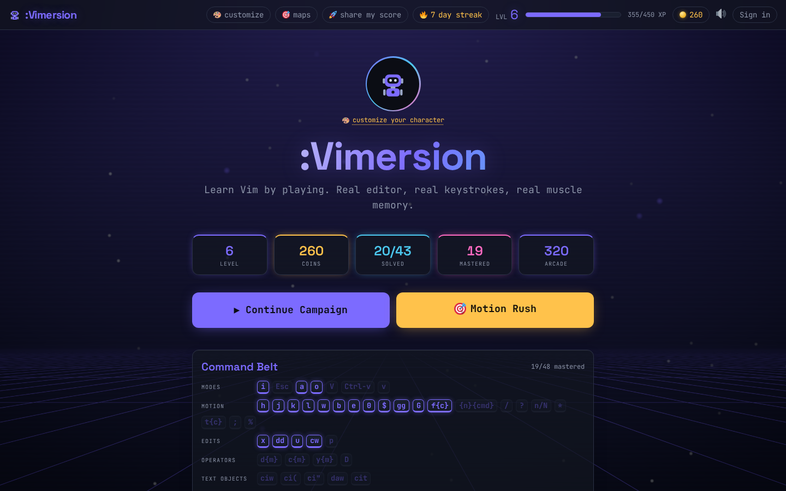
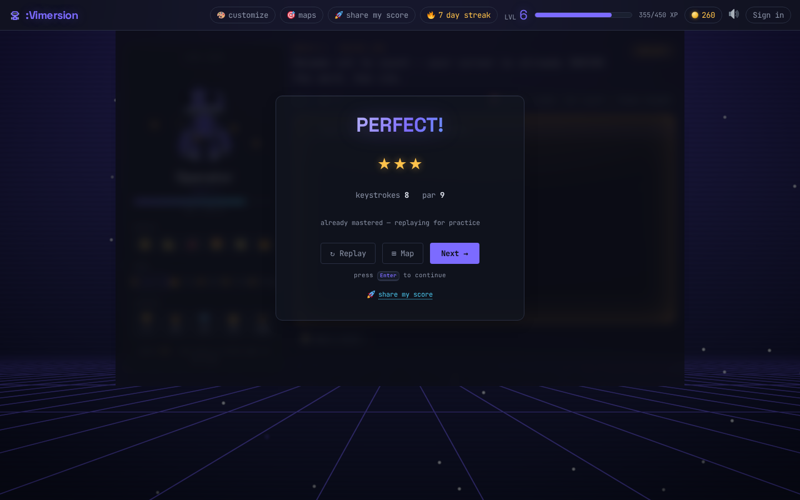
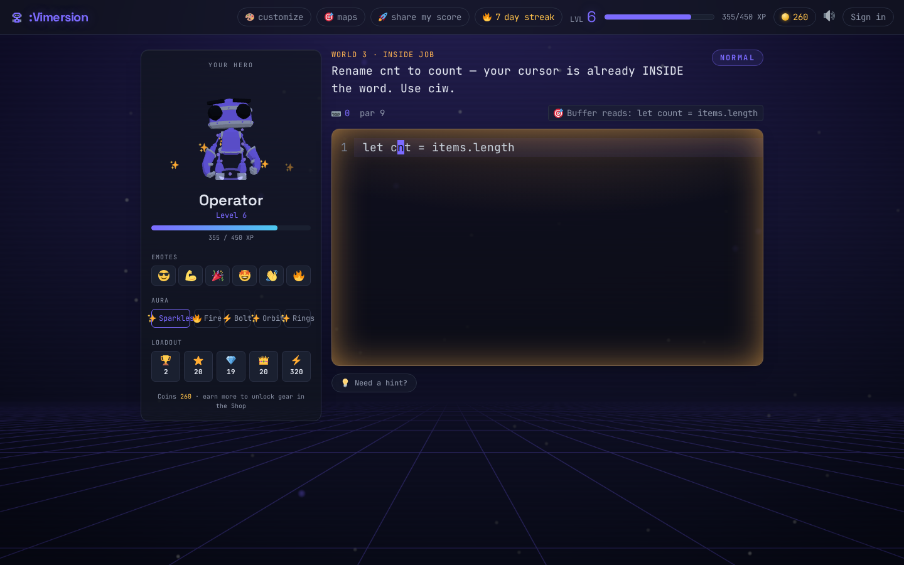
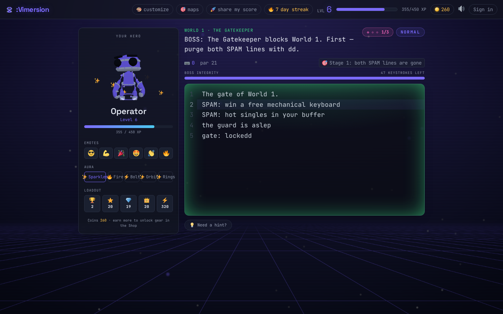
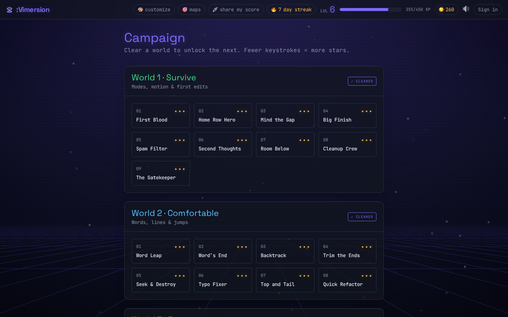
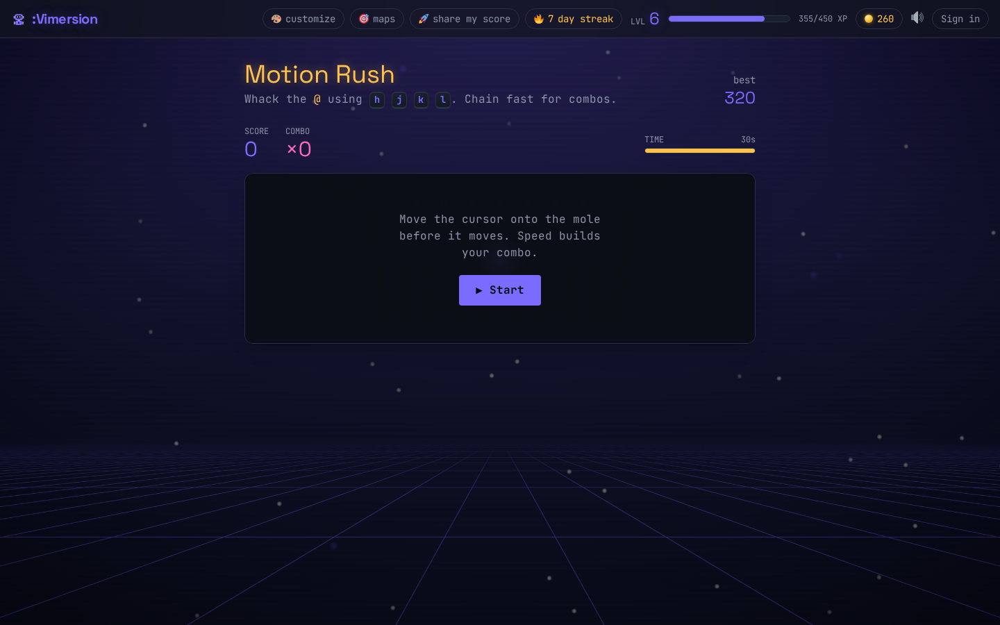
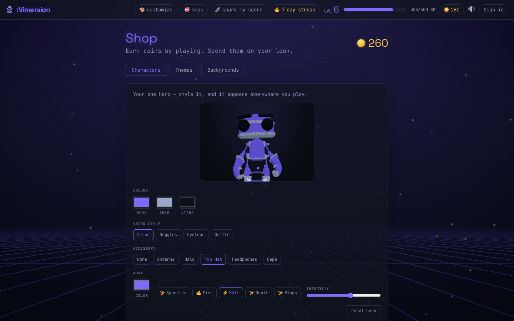
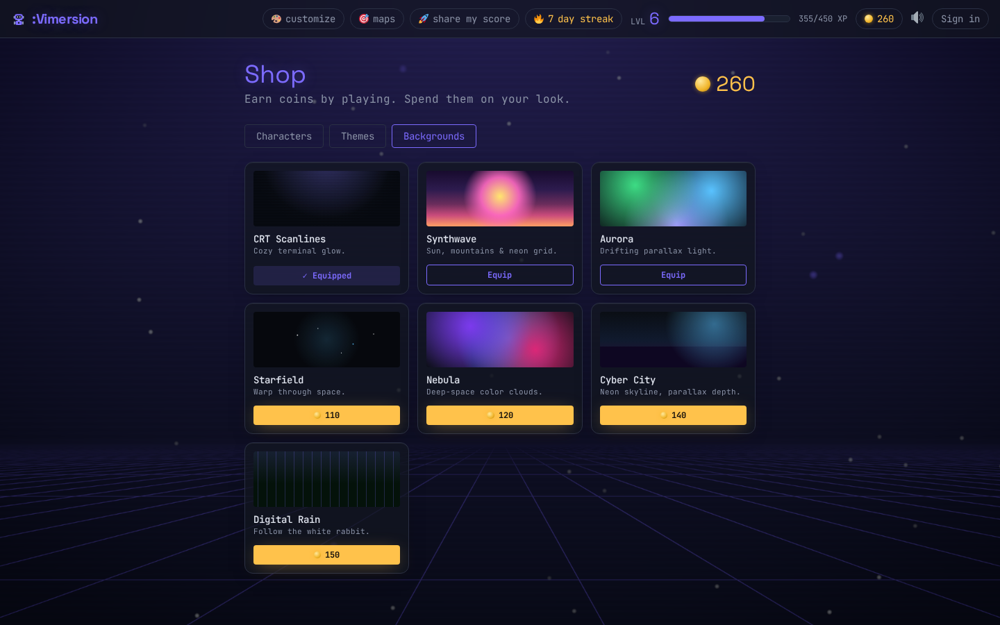
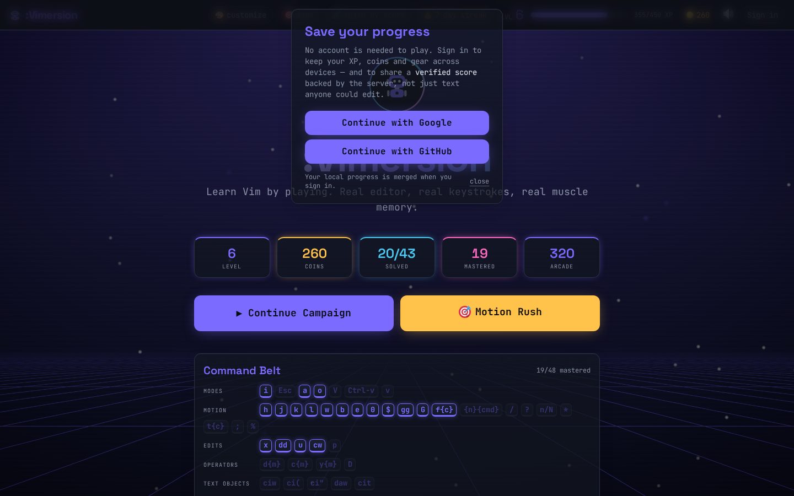
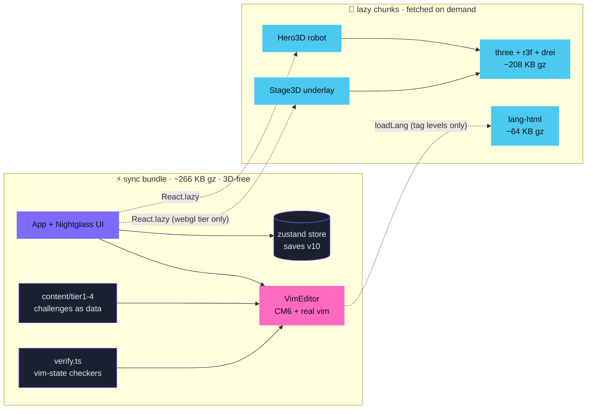

<div align="center">


# :Vimersion

**Learn Vim by playing.** Real editor · real keystrokes · real muscle memory.

[](tsconfig.json)
[](package.json)
[](src/editor)
[](src/three)
[](tests)
[](#-quick-start)



</div>

Unlike maze-style Vim games, **every challenge runs inside a real CodeMirror editor with
genuine Vim keybindings** — the skills transfer 1:1 to actual Vim/Neovim.

> [!TIP]
> **Try it in 30 seconds:** `npm install && npm run dev` → press <kbd>x</kbd> once and
> you've beaten level 1 at par. It escalates from there. 😄

---

## ✨ What's inside

| | |
|---|---|
| 🎯 **VimGolf scoring** | every keystroke counts — beat *par* for ⭐⭐⭐ |
| 👾 **Boss fights** | multi-stage battles with a **keystroke-budget HP bar**; undo can't rewind a cleared stage, and losing costs nothing but a retry |
| 🤖 **Your Hero** | a cel-shaded robot you *restyle* — body/visor/accessory colors + a custom aura — that idles, *punches while you type*, and celebrates your wins |
| 🌋 **Living worlds** | WebGL scenes behind smoked-glass panels (react-three-fiber, selective bloom) — with a full **SVG lite mode** for low-power devices |
| 🧠 **Vim-state goals** | challenges can verify *registers, marks, modes and macros* — not just buffer text |
| ⌨️ **Command Belt** | your growing, category-grouped collection of mastered commands |
| 🕹️ **Motion Rush** | whack-a-mole arcade drilling `hjkl` speed with combos |
| 💾 **Zero backend** | progress in localStorage with versioned migrations; fonts & models self-hosted — **fully offline** |

<div align="center">

<br><em>Beat <b>par</b> for ⭐⭐⭐ — every keystroke counts.</em>
</div>

## 🗺️ The worlds

| | World | You learn | Boss | Status |
|--|-------|-----------|------|:------:|
| 🟢 | **1 · Survive** | modes `i a o Esc` · motion `hjkl` · first edits `x dd u` | 🚪 The Gatekeeper | ✅ |
| 🔵 | **2 · Comfortable** | words `w b e` · line ends `0 $` · jumps `gg G` · `f` · `cw` | — | ✅ |
| 🟠 | **3 · Faster** | operators × motions × **text objects** (`ciw ci( ci" daw cit`) · visual `v V Ctrl-v` | ⚔️ The Refactor Gauntlet | ✅ |
| 🟣 | **4 · Seeker** | search `/ ? n *` · find `f t ;` · `%` · substitute `:s :%s//g :s///gc` · marks | 🔎 Grep & Gut | ✅ |
| 🩷 | **5 · Superpowers** | registers · macros `q @` · the dot `.` · `gn` · `Ctrl-a` | 🏭 *coming* | 🚧 |
| 🟡 | **6 · Legend** | `:g :v` · `:sort` · `:normal` · case ops · block-insert · insert-mode power | 🐉 *coming* | 🚧 |

**43 levels** shipped so far (40 challenges + 3 bosses) — every par machine-proven solvable.

<div align="center">
<table>
<tr>
<td width="50%"></td>
<td width="50%"></td>
</tr>
<tr>
<td align="center"><em>A real editor, your Hero, and a living 3D world</em></td>
<td align="center"><em>Boss fights drain a <b>keystroke-budget</b> HP bar</em></td>
</tr>
<tr>
<td width="50%"></td>
<td width="50%"></td>
</tr>
<tr>
<td align="center"><em>Star-rated progression across worlds</em></td>
<td align="center"><em><b>Motion Rush</b> — drill <code>hjkl</code> speed for combos</em></td>
</tr>
</table>
</div>

## 🎨 Make it yours

One **Hero**, styled your way — pick body / trim / visor colors, a visor style, an
accessory and a custom aura, previewed **live in 3D**. It then shows up everywhere you
play. Earn coins by clearing levels and spend them in the **Shop** on animated scene
backgrounds and terminal color themes.

<div align="center">
<table><tr>
<td width="50%"></td>
<td width="50%"></td>
</tr><tr>
<td align="center"><em>The Hero studio — a live 3D preview you can restyle</em></td>
<td align="center"><em>Spend coins on scenes &amp; themes</em></td>
</tr></table>
</div>

## 🚀 Quick start

```bash
npm install
npm run dev        # play at http://localhost:5173
npm run build      # production build → dist/
npm run preview    # serve the build (port 4173)
```

Deploy `dist/` anywhere static (Netlify / Vercel / GitHub Pages). No special headers —
it's CodeMirror's vim keymap, not WASM, so no cross-origin isolation needed.

### 👤 Optional accounts & verified scores

The game is 100% playable anonymously. Running the tiny zero-dependency backend in
[`server/`](server/README.md) adds **Google / GitHub sign-in**, cross-device progress
sync (local + server merged on login, nothing lost), and **verified share links**
(`?u=<id>`) whose numbers come from the database instead of editable text.
`docker compose up` wires it automatically (`/api` behind nginx); a static deployment
simply hides all account UI. Set `GOOGLE_CLIENT_ID/SECRET` and/or
`GITHUB_CLIENT_ID/SECRET` plus `SESSION_SECRET` — see `server/.env.example`.

<div align="center">

<br><em>Accounts are optional — the game is 100% playable signed out.</em>
</div>

> [!NOTE]
> **Graphics tiers:** quality is **auto-detected per device** — there's no toggle to
> fuss with. Reduced-motion, low-memory, or software-GL devices get **Lite**: the
> original procedural-SVG art, fully featured and not a downgrade of gameplay. If the
> WebGL context is ever lost, the session falls back to Lite automatically.

## 🧪 Testing — pars are proven, not guessed

```bash
npm run test       # 51 vitest tests
npm run qa         # 40 browser checks (needs `npm run preview` running)
npm run typecheck
cd server && npm test   # 52 backend tests (validator + live HTTP round-trips)
```

| Layer | What it guarantees |
|-------|--------------------|
| `tests/content.test.ts` | ids unique · taught commands resolve · cursors in bounds · boss budgets sane |
| `tests/par.test.ts` | **every challenge's par is solved by a reference solution driven through the real vim keymap** — including search/ex/confirm *dialogs* |
| `scripts/qa/` | real-Chromium suites: tier isolation (lite fetches **zero** 3D bytes), boss flow, save migration, offline reload |

> [!IMPORTANT]
> Adding a challenge? Its reference solution in `tests/par.test.ts` is **mandatory** —
> see the [authoring guide](docs/AUTHORING.md).

## 🏗️ Architecture in one picture



The full story — z-stack contract, quality tiers, save migrations, the goal-check
pipeline — lives in **[docs/ARCHITECTURE.md](docs/ARCHITECTURE.md)**.

## ✍️ Adding content

Challenges are **pure data** — a new level is ~15 lines:

```ts
{
  id: 't3-daw',
  tier: 3,
  title: 'Word Surgeon',
  brief: 'Delete the duplicated the cleanly with daw.',
  taughtCommands: ['aw'],
  startText: '… over the the lazy dot',
  startCursor: { line: 1, ch: 36 },
  goal: { targetText: '… over the lazy dot', describe: 'Single spaces everywhere' },
  par: 3,
  hint: 'daw = delete A word — the word PLUS its trailing space.',
}
```

Step-by-step guide (goals, par math, bosses, the traps): **[docs/AUTHORING.md](docs/AUTHORING.md)**.

## 📍 Roadmap

- [x] Worlds 1–4 · boss mechanic · Nightglass 3D slice · vim-state verification
- [ ] 🎨 **Visual rollout** — per-world 3D environments, Map/Shop/Results polish
- [ ] ⚙️ **Mechanics** — overworld map, achievements, daily quests, spaced-repetition review
- [ ] 🩷 **Worlds 5–6** — registers, macros, `:g`/`:sort` power idioms + plugin "Concepts" cards
- [ ] 🏌️ Golf mode, onboarding, remappable keys

## 🙏 Credits

| | |
|---|---|
| 🤖 3D hero | [**RobotExpressive**](https://github.com/mrdoob/three.js) by Tomás Laulhé (CC0, mod. Don McCurdy) — meshopt-optimized, re-shaded with the game's toon ramp |
| 🎨 2D Hero mark | original procedural SVG — the lite-tier twin of the 3D Hero, painted by the same colors, visor & accessory |
| 😀 UI glyphs | [Twemoji](https://github.com/jdecked/twemoji) (CC-BY 4.0), bundled locally |
| 🔤 Fonts | [Space Grotesk](https://fonts.google.com/specimen/Space+Grotesk) + [JetBrains Mono](https://www.jetbrains.com/lp/mono/) (OFL), self-hosted via Fontsource |
| 🌋 Scenes | original procedural CSS/SVG (lite) and three.js (3D) — no asset downloads |

<div align="center">

**Free & open source. Built with real Vim keybindings.** ⌨️💜

</div>
