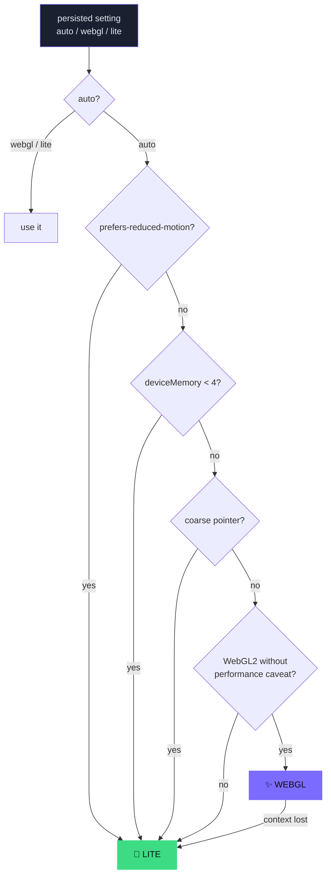
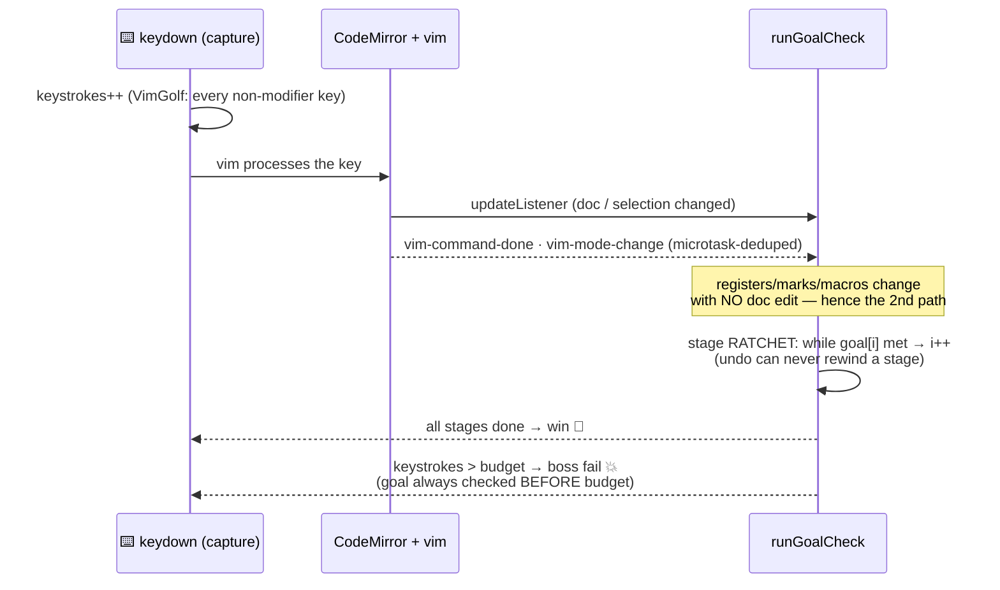

# 🏗️ Architecture

How Vimersion stays a **fast, offline, static web game** while running a real Vim editor
under a real-time 3D world.

## 🥇 The one sacred rule

> [!IMPORTANT]
> **The editor is sacred.** Keystrokes are counted by a capture-phase `keydown` listener
> on the CodeMirror DOM (`src/editor/VimEditor.tsx`), and the editor remounts via a React
> `key`. Therefore: nothing may steal its focus, nothing may wrap it in a suspending
> subtree, and no decorative layer may capture pointer events. Every rule below exists in
> service of this one.

## 🧅 Runtime layers (the z-stack contract)

| z | Layer | Interactive? |
|---|-------|:---:|
| 30 | Result / boss-fail overlays | ✅ |
| 20 | HUD (glass bar, FX + sound toggles) | ✅ |
| 10 | Screens: editor, panels, buttons | ✅ |
| 0 | **Stage3D** WebGL canvas *or* lite SVG `Background` | 🚫 `pointer-events-none`, `aria-hidden` |

Buttons that live near the editor use `onMouseDown={e => e.preventDefault()}` so clicking
them never moves focus out of the buffer.

## 🎚️ Quality tiers

- **Lite** = the original procedural SVG/CSS scenes (`Background.tsx`, `LevelScene.tsx`) —
  kept byte-for-byte, zero 3D bytes ever fetched.
- **WebGL** = one persistent full-viewport `<Canvas>` (`src/three/Stage3D.tsx`) mounted as
  a *sibling* of the routed content (never inside the transform-animating `motion.main`,
  where `position:fixed` breaks), plus a tiny dedicated hero canvas in the HeroPanel.
- The lite background stays mounted until Stage3D paints its first frame → crossfade,
  **never a blank flash**. A `PerformanceMonitor` steps dpr 1.75 → 1.25 → 1 and drops
  bloom at the bottom step. Hidden tab ⇒ `frameloop="never"`.
- UI ↔ 3D bridge: `src/three/stageState.ts`, a tiny **non-persisted** zustand store with
  no `three` imports (lives in the sync bundle, written by App/CampaignMode, read inside
  the canvases). No prop-drilling through animated wrappers.

## 🎯 The goal-check pipeline

Goals are either `targetText` (exact buffer match) or a `predicate(view, vimCtx)`.
`src/game/verify.ts` provides composable checkers — `registerEquals`, `markSet`,
`inMode('visualBlock')`, `recordedMacro`, `cursorLine`, combined with `allOf/anyOf/not` —
so challenges can verify **vim state**, not just text.

> [!NOTE]
> Exact-text goals complete the instant the buffer matches — often **while still in
> insert mode**, before the closing `Esc`. Par math accounts for this
> (see [AUTHORING.md](AUTHORING.md)).

## 📦 Bundle discipline

| Chunk | Size (gz) | When fetched |
|-------|----------:|--------------|
| `index` (App, editor, vim, content, UI) | ~266 KB | always — **must stay 3D-free** |
| shared three/r3f/drei graph | ~208 KB | webgl tier, on idle |
| `Stage3D` / `Hero3D` entries | ~20 KB each | webgl tier, on idle |
| `lang-html` (syntax tree for `it`/`at`) | ~64 KB | first tag-object level only |
| `hero.glb` (meshopt) | 183 KB | webgl tier |

> [!WARNING]
> **No `manualChunks`.** Hand-grouping a vendor-3d chunk once made rolldown merge the
> shared `scheduler` module into it, statically chaining `index → vendor-3d` — every
> lite-tier visitor downloaded 890 KB of three.js. The two dynamic imports isolate the 3D
> graph automatically. Verify after build: `dist/index.html` must contain **no**
> `modulepreload` of 3D chunks.

## 💾 Save versions

localStorage key `vimersion-save`, zustand `persist` with versioned `migrate()`:

| v | Change | Migration behavior |
|---|--------|--------------------|
| 3→4 | default background → *Pixel Kingdom* | old default remapped, stays owned |
| 4→5 | `quality` setting · default theme → *Nightglass* | `quality:'auto'` backfilled; players on old default theme moved (phosphor stays free) |
| 5→6 *(planned)* | settings/streak/SRS/quests/achievements reshape | retro-grants ("migration dividend") |

Progress is keyed by **challenge id** and mastery by **command id** — so reordering
levels or re-tiering commands is save-safe; *renaming ids is not*.

## 🧪 Test architecture

- **vitest (jsdom)** — `tests/driver.ts` builds a real `EditorView` with the production
  extension stack and feeds keys via `Vim.handleKey`. jsdom has no layout, so the vim
  shim's pixel-based `findPosV`/`charCoords` are stubbed with logical line math.
  **Dialogs** (`/`, `:`, and the `:s///c` confirm) are driven by synthesizing `keydown`
  events on the dialog's `<input>` — keystroke counts match real play.
- **Playwright (`scripts/qa/`)** — real Chromium against the production build: tier
  isolation, boss flow, save migration, offline reload. Never `.click()` the editor
  (it moves the vim cursor); the editor auto-focuses on mount.
